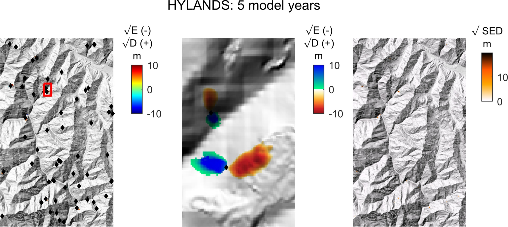

# pub_hylands_campforts_etal_GMD
This repository contains example code and documentation related to the following manuscript:
Campforts B., Shobe M.C., et al. : HyLands 1.0: a Hybrid Landscape evolution model to simulate the impact of landslides and landslide-derived sediment on landscape evolution. Discussion paper in Geoscientific Model Development, https://gmd.copernicus.org/preprints/gmd-2020-74

# HyLands model

HyLands is contained within the ttlem software. Installation for detailed and updated instructions and/or documentation, see: https://github.com/BCampforts/topotoolbox/tree/HyLands/ttlem

## User manual HyLands

Installation: 
 - Download and extract topotoolbox from: https://github.com/BCampforts/topotoolbox (the HyLands branch, which is the default branch on the linked repository so nothing has to be adjusted, downloaded fodler will be named: topotoolbox-HyLands by default)
 - Before working with HyLands the directories and functions must be on the search path of Matlab. Enter following code into the command line: addpath(genpath(['C:\path\to\wherever\you\extracted\this\topotoolbox-HyLands']));
 - to verify installation: enter: doc HYLANDS (info on the model) or doc HYLANDS_set (info on the parameter values) in the command window.
 
Documentation: 
 - For documentation, enter: doc HYLANDS (info on the model) or doc HYLANDS_set (info on the parameter values) in the command window. 
        

HyLands comes with 1 tutorial (the example provided on the documentation page: doc HYLANDS), and 7 sripts, described in full length in the GMD discussion paper: Campforts B., Shobe M.C., et al. : HyLands 1.0: a Hybrid Landscape evolution model to simulate the impact of landslides and landslide-derived sediment on landscape evolution. Discussion paper in Geoscientific Model Development, https://gmd.copernicus.org/preprints/gmd-2020-74

All the scripts can be executed in Matlab. 
- HyLands_NoLS_DL.m;    https://doi.org/10.5446/45969
- HyLands_NoLS_TL.m;    https://doi.org/10.5446/45967
- HyLands_NoLS_Mixed.m; https://doi.org/10.5446/45968
- HyLands_LS_NB.m;      https://doi.org/10.5446/45973
- HyLands_LS_B_LS.m;    https://doi.org/10.5446/45970
- HyLands_LS_LS.m;      https://doi.org/10.5446/45971
- HyLands_LS_A_LS.m;    https://doi.org/10.5446/45972

## Version History

HyLands V1.0 --- 15. March 2020 
- HyLands added to ttlem

